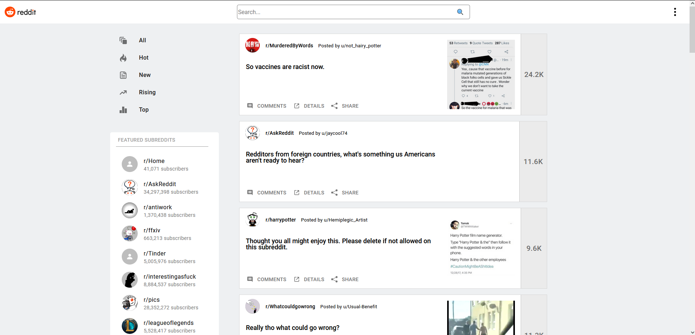
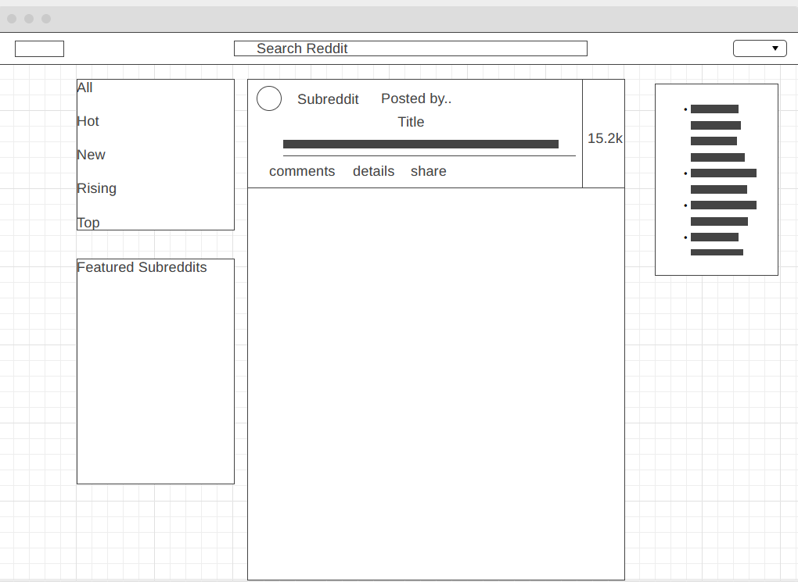
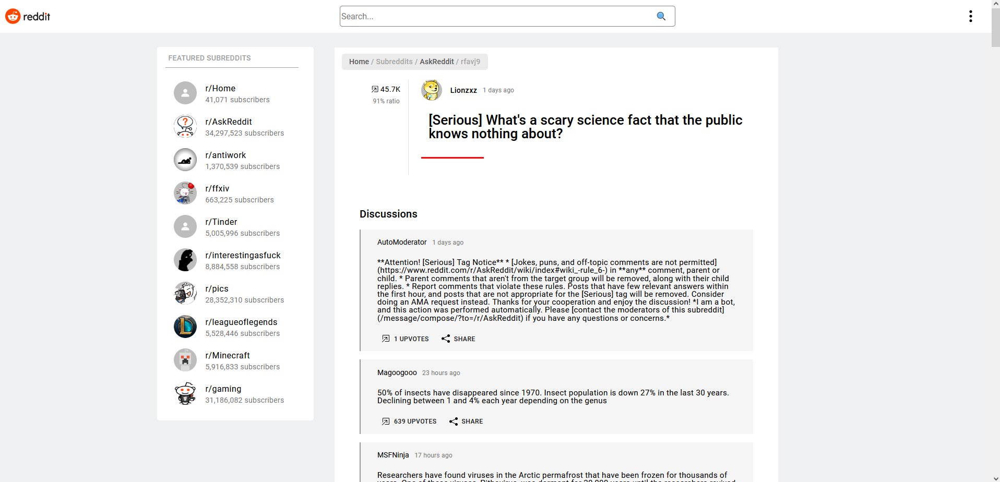
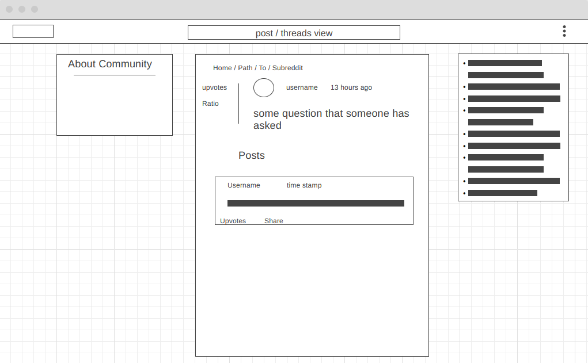
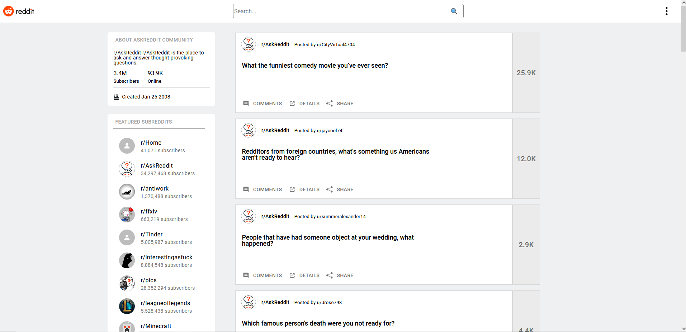
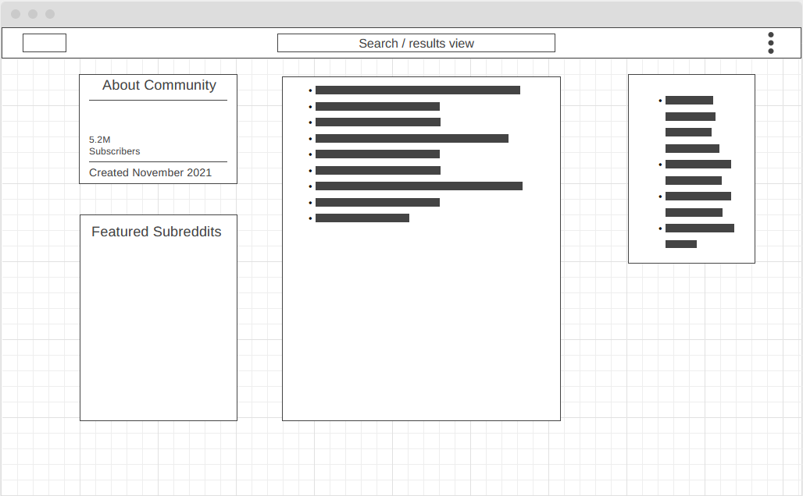

# Reddit Minimal - reddit client

## Table of contents

- [Reddit Minimal - reddit client](#reddit-minimal---reddit-client)
  - [Table of contents](#table-of-contents)
  - [General info](#general-info)
  - [Design](#design)
    - [Initial view and wireframe](#initial-view-and-wireframe)
    - [Thread view and wireframe](#thread-view-and-wireframe)
    - [Subreddit view and wireframe](#subreddit-view-and-wireframe)
  - [Routes](#routes)
  - [Technologies](#technologies)
  - [Setup](#setup)
  - [Status](#status)
  - [Tests](#tests)

## General info

***If the app does not load in firefox, disable enhanced tracking protection - see*** <https://github.com/jumboindex/Reddit-Minimal/issues/5>

This application is a clone of the popular social media website Reddit - <https://www.reddit.com/>.

The app is built using React, Redux, react-router-dom, markdown-to-jsx and makes use of assets from react-icons and react-bootstrap. However, the majority of the front-end components are built from scratch (which proved to be quite time intensive when adding additional features which I will discuss later). The app makes use of the reddit json API (<https://github.com/reddit-archive/reddit/wiki/JSON>), manages state via Redux and is rendered using React.

At a high level, the app initially queries the reddit API and stores data via a Redux store slice. A number of additional API calls are then dispatched to fetch assets such as user avatars or trending / featured subreddit data which is not available in the initial API call. Skeleton assets will populate the page until data is fetched and rendered. Note: comment / thread content returned via API calls is in the form of markdown or unescaped HTML string, and thus markdown-to-jsx library is used to render this data.

Once the initial view is rendered the user is able to:

- view the initial posts and associated media
- view the entire thread with comments for any post with associated media / metadata
- view associated subreddit for a given thread, with about information for subreddit and most recent posts / threads
- filter posts by trend i.e. all, hot, new, rising, and top
- filter posts by featured subreddit menu (top 10 subreddits at time of view)
- search for any topic which returns a list of associated posts which a user can drill into.
- change theme between night and day mode
- share via copying the URL

URLs generated for posts / threads / searches are dynamic and URL params are used to generate / dispatch queries. In addition middleware is used (async Thunks) to dispatch async requests and track lifecycles i.e loading and error states.

 ---

In hindsight and if I were to start again, use of a component library such as material-ui or react-bootstrap would be the way to go. Having pre-built components would have saved time when adding features such as dark mode or mobile view.

## Design

initial wireframes and final design are below, not some features in wireframes had to be stripped due to time constraints.

### Initial view and wireframe

### Thread view and wireframe

### Subreddit view and wireframe

## Routes

- `/` - home
- `/hot` - filtered content
- `/new` - filtered content
- `/rising` - filtered content
- `/top` - filtered content
- `/post/:subreddit/:postID` - subreddit thread view
- `/subreddit/:subreddit` - list of subreddit posts and about information
- `/search/:searchTerm` - search view
- `/*` - no URL match or invalid search term view

## Technologies

- Javascript
- React
- Redux / Redux Toolkit
- react-router-dom
- markdown-to-jsx

## Setup

`npm start`

## Status

Project is: Beta v0.1

## Tests

This project has a number of unit test which make use of Jest and React-testing-libary. After initially trying Enzyme, I selected React-testing-libary as I found it was easier to use. The tests are by no way finished or fleshed out (with MenuButton.test.js being the most fleshed out), and will revisited time permitting.

